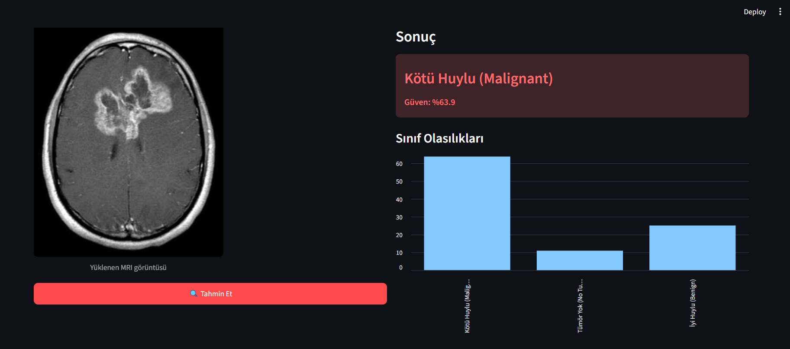
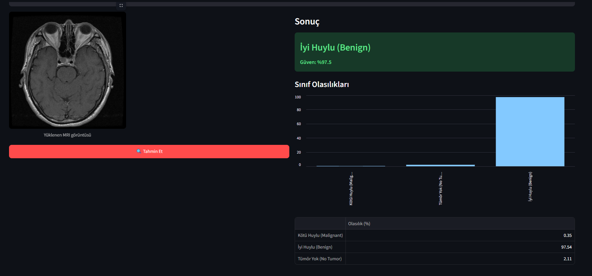

# 🧠 Makine Öğrenmesi ile İyi/Kötü Huylu Beyin Tümörü Sınıflandırması

Microsoft AI Innovator Programı kapsamında geliştirilen, MRI görüntüleri üzerinden
beyin tümörlerinin **iyi huylu (benign)** ve **kötü huylu (malignant)** olarak
sınıflandırılmasını amaçlayan bir derin öğrenme projesi.

## 📌 Proje Özeti

Bu proje, transfer learning (ResNet18) kullanarak beyin MRI görüntülerinden
tümör tipini tahmin eden bir sınıflandırma modeli geliştirmeyi amaçlar.

**Not (Bilimsel Sınırlama):** Kullanılan açık kaynak veri setinde doğrudan
"iyi huylu / kötü huylu" etiketi bulunmamaktadır. Bunun yerine, tıbbi
literatürdeki genel eğilimlere dayanarak aşağıdaki eşleme kullanılmıştır:

| Orijinal Sınıf | Eşlenen Sınıf |
|---|---|
| Glioma | Kötü Huylu (Malignant) |
| Meningioma | İyi Huylu (Benign) |
| Pituitary | İyi Huylu (Benign) |
| No Tumor | Tümör Yok |

Bu basitleştirme, gerçek klinik tanı yerine geçmez; eğitim/araştırma amaçlıdır.

## 📂 Veri Seti

- **Kaynak:** [Brain Tumor MRI Dataset (Kaggle)](https://www.kaggle.com/datasets/masoudnickparvar/brain-tumor-mri-dataset)
- **Sınıflar:** Glioma, Meningioma, Pituitary, No Tumor → Benign / Malignant / No Tumor olarak yeniden etiketlenir
- Veri seti boyutu nedeniyle bu repoya dahil edilmemiştir. `data/README.md` içinde indirme talimatları bulunur.

## 🏗️ Proje Yapısı

```
brain-tumor-classification/
├── data/                   # Veri seti (indirilecek, repoya dahil değil)
├── notebooks/              # Keşifsel veri analizi (EDA) notebook'ları
├── src/
│   ├── dataset.py          # Veri yükleme ve etiket eşleme
│   ├── model.py             # Model mimarisi (ResNet18 transfer learning)
│   ├── train.py              # Eğitim döngüsü
│   └── evaluate.py          # Değerlendirme ve metrikler
├── models/                 # Eğitilmiş model ağırlıkları
├── outputs/                 # Grafikler, confusion matrix, raporlar
├── requirements.txt
└── README.md
```

## ⚙️ Kurulum

```bash
git clone <repo-url>
cd brain-tumor-classification
python -m venv venv
source venv/bin/activate   # Windows: venv\Scripts\activate
pip install -r requirements.txt
```

## 🚀 Kullanım

### Yerelde (GPU'nuz güçlüyse)
```bash
# Veri setini data/ altına indirdikten sonra:
python src/train.py --epochs 15 --batch-size 32 --lr 0.0001
```

### Google Colab (önerilen — düşük VRAM'li kartlar için)
Düşük VRAM'li GPU'larda (örn. 4GB) eğitim yavaş olabileceğinden,
`notebooks/train_colab.ipynb` dosyasını Colab'da açıp ücretsiz T4 GPU ile
çalıştırmanız önerilir:

1. [Google Colab](https://colab.research.google.com)'a git, `Dosya > Not defteri yükle`
   ile `notebooks/train_colab.ipynb` dosyasını aç (ya da GitHub linkiyle direkt aç).
2. `Çalışma Zamanı > Çalışma zamanı türünü değiştir > T4 GPU` seç.
3. Hücreleri sırayla çalıştır (repo klonlama, Kaggle veri indirme, eğitim, değerlendirme).
4. Eğitilen modeli (`best_model.pth`) ve confusion matrix'i indirip repoya ekle.

## 🧪 Yöntem

- **Model:** ResNet18 (ImageNet ön-eğitimli), son katman 3 sınıfa (Benign/Malignant/No Tumor) uyarlanmış transfer learning
- **Veri artırma:** Rastgele döndürme, çevirme, kontrast ayarı
- **Kayıp fonksiyonu:** CrossEntropyLoss
- **Optimizasyon:** Adam
- **Değerlendirme:** Accuracy, Precision, Recall, F1-score, Confusion Matrix

## 📊 Sonuçlar

Model, sınıf ağırlıklı loss (Malignant sınıfına 1.5x ağırlık) ile eğitilmiştir;
bu, klinik açıdan daha kritik olan kötü huylu vakaların kaçırılma oranını
azaltmayı hedefler.

**Genel doğruluk: %86**

| Sınıf | Precision | Recall | F1-score |
|---|---|---|---|
| Malignant (Kötü Huylu) | 0.84 | 0.71 | 0.77 |
| Benign (İyi Huylu) | 0.89 | 0.88 | 0.89 |
| No Tumor (Tümör Yok) | 0.83 | 0.97 | 0.90 |

Confusion matrix: `outputs/confusion_matrix.png`

**Not:** Malignant recall (%71), modelin gerçek kötü huylu vakaların
%71'ini doğru yakaladığını gösterir. Bu değer, tıbbi bağlamda yanlış
negatiflerin (kaçırılan vakaların) maliyetinin yüksek olması nedeniyle
öncelikli olarak izlenmiştir ve sınıf ağırlıklandırması ile
iyileştirilmiştir (başlangıç değeri: %60).

## 🖥️ Ekran Görüntüleri

**Kötü huylu (malignant) tahmin örneği:**



**İyi huylu (benign) tahmin örneği:**



## 🎯 Microsoft AI Innovator Bağlamı

Bu proje; veri ön işleme, transfer learning, model değerlendirme ve
etik/sınırlama farkındalığı (tıbbi veri kullanımında dikkat gerektiren
noktalar) konularında uçtan uca bir uygulamalı örnek sunmayı amaçlar.

## ⚠️ Sorumluluk Reddi

Bu proje **klinik tanı amacıyla kullanılamaz**. Sadece eğitim ve
araştırma amaçlıdır. Gerçek tıbbi kararlar mutlaka uzman hekimler
tarafından verilmelidir.

## 👤 Geliştirici

Emirhan Uzen

## 📄 Lisans

MIT License
